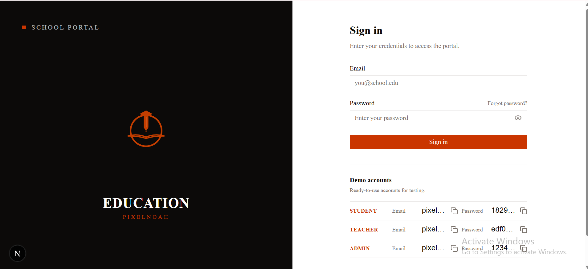
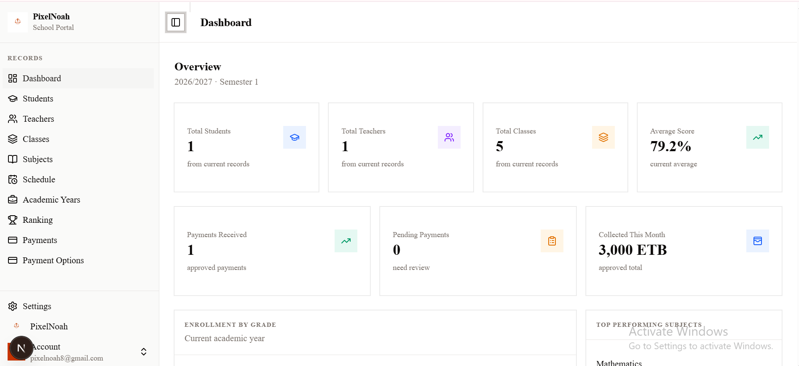
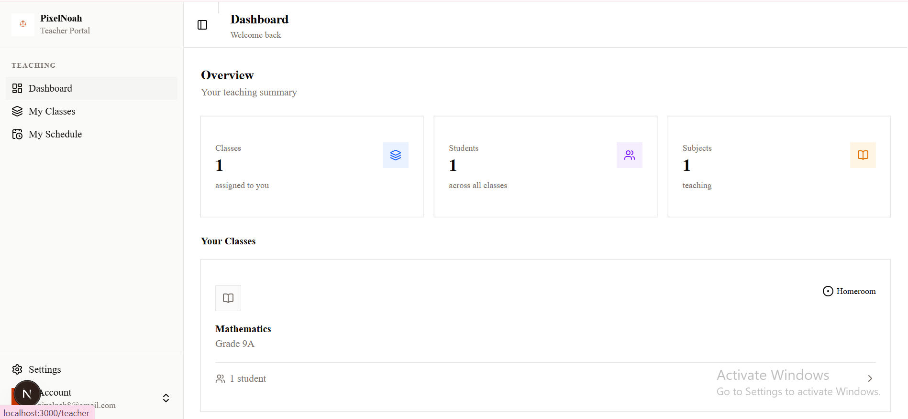
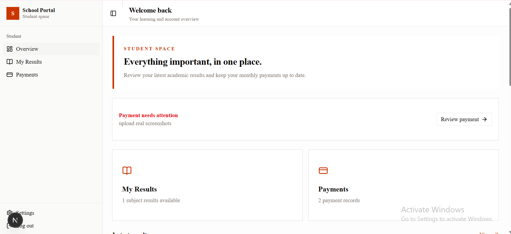
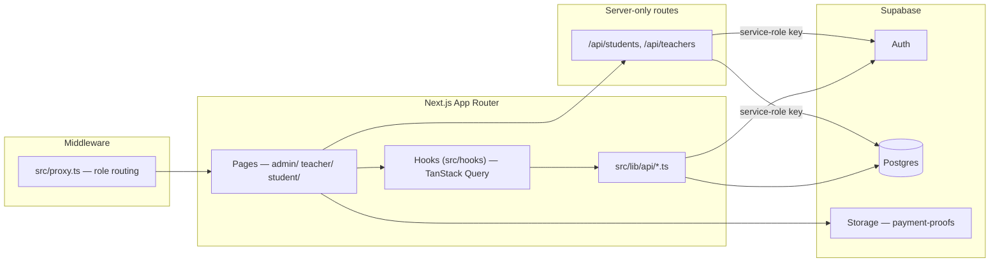
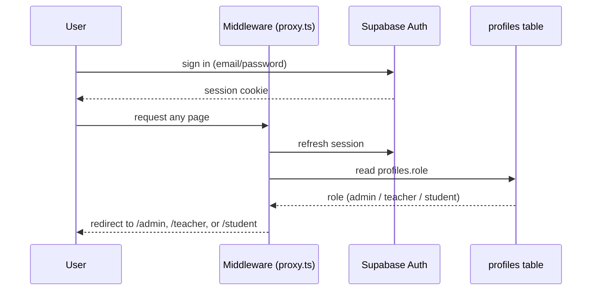
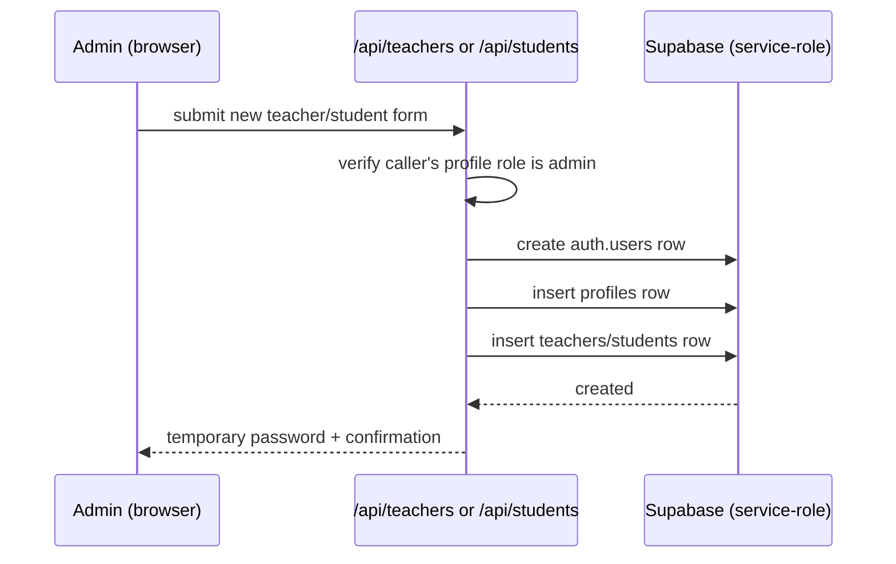
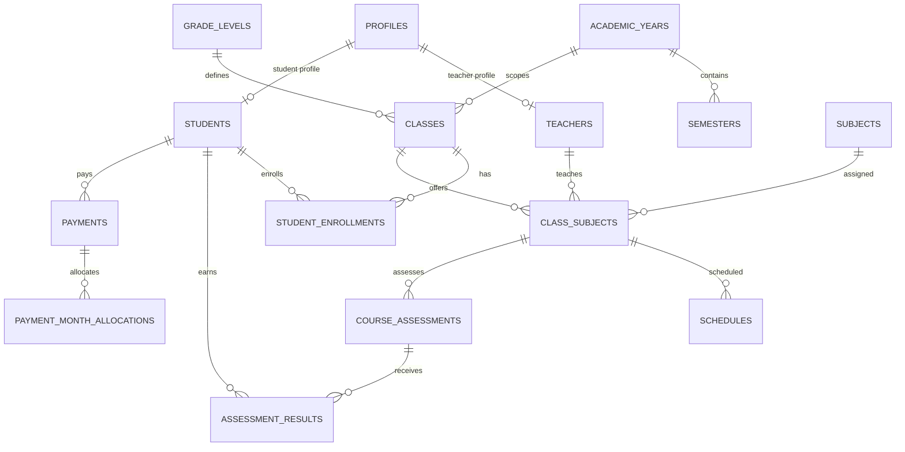

<div align="center">


# 🏫 SchoolPortal — Role-Based School Management System


**A single Next.js app that gives admins, teachers, and students their own workspace — academic-year setup, class and subject assignment, grading, scheduling, and tuition payments, all behind Supabase Auth and role-based routing.**

[](https://github.com/PixelNoah-ui/schoolportal)
[](https://schoolportal.vercel.app)
[](#-license)


</div>

---

## 📖 Overview

SchoolPortal is a **single Next.js 16 App Router codebase** with three role-scoped sections — `/admin`, `/teacher`, `/student` — sharing one Supabase backend (Auth, Postgres, Storage). A middleware layer (`src/proxy.ts`) reads the signed-in user's role and keeps them inside their own section.

It covers the full academic cycle: academic years and semesters, class and subject assignment, teacher/student provisioning, assessments and grading, class rankings, weekly schedules, and student tuition payments with proof-of-payment upload (bank transfer, mobile money, or cash — logos for CBE, Awash Bank, and Telebirr ship in `public/`).

> The project ships its own architectural audit at [`docs/schoolportal-architectural-audit.md`](docs/schoolportal-architectural-audit.md) — a full review of every data flow, table, and known bug in the repo. This README pulls its **Security** and **Next Steps** sections directly from it, so nothing below is hidden or glossed over.

---

## 🖼️ Screenshots

The deployed portal is available at [schoolportal.vercel.app](https://schoolportals.vercel.app).

| Login                                                         | Admin dashboard                                                    |
| ------------------------------------------------------------- | ------------------------------------------------------------------ |
| [](screenshots/login.png) | [](screenshots/admin.png) |

| Teacher dashboard                                                          | Student dashboard                                                          |
| -------------------------------------------------------------------------- | -------------------------------------------------------------------------- |
| [](screenshots/teachers.png) | [](screenshots/studnets.png) |

---

## ✨ Features

**Admin:** academic years & semesters, grade levels & classes, subject catalog, class-subject-teacher assignment, teacher & student provisioning (creates the Supabase Auth user, profile, and domain row in one flow), assessment types, weekly schedules, payment review, class rankings, settings.

**Teacher:** dashboard of assigned classes and upcoming schedule, class roster and per-student detail, grading-structure editor and score entry, weekly schedule view, profile settings.

**Student:** personal dashboard/overview, results by subject and semester, payment submission (bank transfer / mobile money / cash) with status tracking, account settings.

**Auth:** Supabase Auth email/password login, forgot-password and reset-password flows, and a single middleware that redirects unauthenticated visitors to `/login` and routes everyone else into their role's section.

---

## 🧰 Tech Stack

<div align="center">


</div>

| Layer                 | Technology                                                          |
| --------------------- | ------------------------------------------------------------------- |
| Framework             | Next.js 16 (App Router, React Server Components)                    |
| Language              | TypeScript                                                          |
| UI                    | shadcn/ui, Tailwind CSS v4, lucide-react icons                      |
| Data fetching / cache | TanStack Query v5                                                   |
| Backend               | Supabase — Postgres, Auth, Storage                                  |
| Charts                | Recharts                                                            |
| Forms                 | react-hook-form                                                     |
| Deploy                | Vercel — [schoolportal.vercel.app](https://schoolportals.vercel.app) |

---

## 🏗️ Architecture



**Login and role routing:**



**Teacher/student provisioning (admin-only, server-side):**



**Core entity relationships** (trimmed for readability — the full proposed schema is in the audit doc):



---

## 📁 Folder Structure

```text
schoolportal/
├── src/
│   ├── app/
│   │   ├── (auth)/          # login, forgotpassword, resetpassword
│   │   ├── admin/           # years, classes, subjects, teachers, students,
│   │   │                    #   assessments, schedule, payments, rankings, settings
│   │   ├── teacher/         # classes, schedule, settings
│   │   ├── student/         # overview, results, payments, settings
│   │   └── api/             # service-role provisioning routes (students, teachers)
│   ├── components/
│   │   ├── admin/ teacher/ student/   # section-specific components
│   │   └── ui/                        # shadcn/ui primitives
│   ├── hooks/                # one TanStack Query hook per resource
│   ├── lib/
│   │   ├── api/               # Supabase query functions used by the hooks
│   │   ├── ranking/            # ranking & standing calculation logic
│   │   └── roles.ts            # UserRole type + role parsing
│   ├── utils/supabase/        # browser / server / middleware Supabase clients
│   └── proxy.ts               # role-based route protection & redirects
├── supabase/
│   ├── rebuild.sql                       # full clean-rebuild schema + RLS
│   ├── payment-options.sql
│   ├── update-grade-score-limits.sql
│   └── update-grading-structure-total.sql
└── docs/
    └── schoolportal-architectural-audit.md   # full architecture & data-model audit
```

---

## ⚙️ Installation

```bash
git clone https://github.com/PixelNoah-ui/schoolportal.git
cd schoolportal
npm install
cp .env.example .env.local   # file doesn't exist yet — create it, see below
npm run dev                  # http://localhost:3000
```

There's no seed script, so create your first admin manually: sign a user up through Supabase Auth (or the app's login page), then set that user's `role` to `admin` directly on their `profiles` row from the Supabase dashboard.

---

## 🔑 Environment Variables

**`.env.local`**

```bash
NEXT_PUBLIC_SUPABASE_URL=https://your-project.supabase.co
NEXT_PUBLIC_SUPABASE_PUBLISHABLE_KEY=your_supabase_publishable_key

# Server-only — used exclusively by /api/students and /api/teachers
SUPABASE_SERVICE_ROLE_KEY=your_supabase_service_role_key
```

> `SUPABASE_SERVICE_ROLE_KEY` bypasses RLS entirely. It's only ever read server-side in the two provisioning routes — never expose it to the client or commit it.

---

## 🗄️ Database

No migration tool is checked in yet — the schema is plain SQL under `supabase/`. Apply it **in order**, ideally against a disposable Supabase project first:

1. `supabase/rebuild.sql` — drops and recreates the entire public schema: tables, constraints, indexes, RLS policies, helper functions.
2. `supabase/payment-options.sql` — the `payment_options` table students choose from at checkout.
3. `supabase/update-grade-score-limits.sql`
4. `supabase/update-grading-structure-total.sql`

Then seed one academic year + semester, one grade level, one subject, one assessment type, and your first admin profile.

---

## 🔌 Data Access Summary

There's no separate REST/GraphQL backend — pages call Supabase directly through hooks and `lib/api/*.ts`. Two exceptions are the server-only provisioning routes.

| Area           | Pages                                             | Hook / API                                                              | Tables                                                               |
| -------------- | ------------------------------------------------- | ----------------------------------------------------------------------- | -------------------------------------------------------------------- |
| Auth           | `(auth)/login`, `forgotpassword`, `resetpassword` | `use-auth` → `lib/api/auth`                                             | `auth.users`, `profiles`                                             |
| Academic years | `admin/academic-years`                            | `use-academic-years`                                                    | `academic_years`, `semesters`                                        |
| Classes        | `admin/classes[/[classId]]`                       | `use-classes`, `use-class-subjects`                                     | `classes`, `class_subjects`, `subjects`, `teachers`                  |
| Teachers       | `admin/teachers`                                  | `use-teachers` + `/api/teachers`                                        | `teachers`, `profiles`, `auth.users`                                 |
| Students       | `admin/students`                                  | `use-students` + `/api/students`                                        | `students`, `profiles`, `classes`                                    |
| Assessments    | `admin/assessments`                               | ⚠️ direct Supabase calls in the page, bypassing the hook/api convention | `assessment_types`                                                   |
| Rankings       | `admin/rankings[...]`                             | `use-rankings`, `use-grades`                                            | `grades`, `assessment_results`, `course_grade_submissions`           |
| Schedule       | `admin/schedule`                                  | `use-schedules`                                                         | `schedules`, `class_subjects`                                        |
| Payments       | `admin/payments`, `student/payments`              | `use-payments`                                                          | `payments`, `payment_month_allocations`, Storage `payment-proofs`    |
| Teacher portal | `teacher/**`                                      | teacher hooks/api                                                       | ⚠️ URL protection doesn't verify assignment ownership — see Security |
| Student portal | `student/**`                                      | `use-student-portal`, `use-student-grades`                              | `students`, `assessment_results`, `payments`                         |

---

## 🔐 Authentication

Supabase Auth email/password, session held in a cookie and refreshed by `src/utils/supabase/middleware.ts` on every request. `src/proxy.ts` reads the resolved role and enforces section boundaries (`/admin`, `/teacher`, `/student`), redirecting anonymous users to `/login` and signed-in users away from sections that don't match their role.

---

## 🛡️ Security

**In place:** Supabase-managed session cookies, role-based route redirection in middleware, the service-role key isolated to two provisioning routes, and a full RLS design already written in `rebuild.sql`.

**Gaps** (documented in the project's own audit, [`docs/schoolportal-architectural-audit.md`](docs/schoolportal-architectural-audit.md)):

- **Role trust order** — auth and middleware read `user_metadata.role` before falling back to `profiles.role`. User metadata is client-mutable, so `profiles.role` should be the only authoritative source.
- **RLS is unverified** — no policy/migration files are checked into version control history beyond `rebuild.sql`'s proposal; every direct browser Supabase call is currently an unverified authorization boundary until that's applied and tested.
- **Plaintext temporary passwords** — `temporary_password` is stored on teacher/student rows and returned in admin API responses.
- **Non-transactional provisioning** — the auth user, profile, and domain row aren't created in one transaction, and a failing teacher-assignment insert is silently ignored.
- **Storage orphaning** — a payment-proof upload can succeed while the following `payments` insert fails, leaving an orphaned file.

---

## 🔭 Next Steps

1. Make `profiles.role` the sole source of truth for authorization — stop trusting `user_metadata.role` — **highest priority**
2. Apply and verify RLS from `supabase/rebuild.sql` against a live project; nothing else here holds up without it
3. Unify the two grading models (`grades` vs. `assessment_results`) before extending rankings further
4. Remove plaintext `temporary_password` storage in favor of a one-time delivery flow
5. Wire up attendance (tables are reserved in the schema but unused) or drop them
6. Add automated tests, CI, and a `LICENSE`

---

## 🤝 Contributing

Fork → branch → `npm install` → apply `supabase/rebuild.sql` and the other SQL files to your own Supabase project → match the existing hook / `lib/api` convention for new resources → open a PR. If your change touches auth or role checks, read the **Security** section above first.

---

## 📄 License

Not detected — no `LICENSE` file in the repo. Add one (MIT, or a proprietary notice) if you intend to distribute or open-source this project.

---

## 👤 Author

**PixelNoah** — Jimma, Ethiopia — [@PixelNoah-ui](https://github.com/PixelNoah-ui)

<div align="center">


</div>
