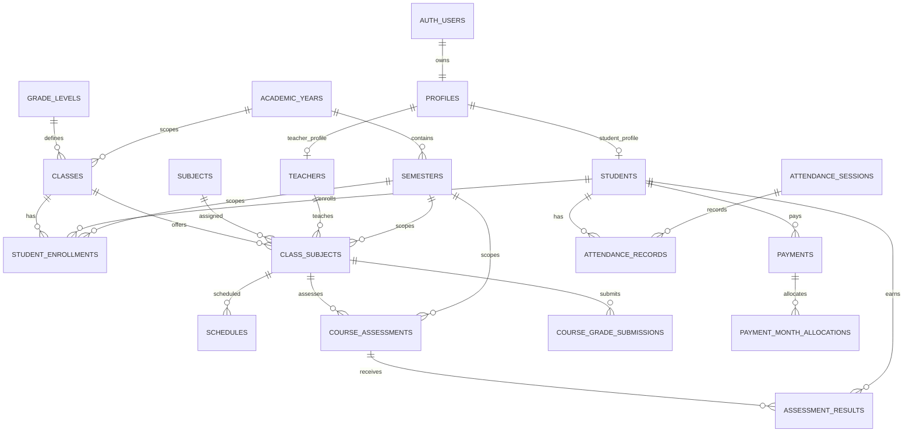

# SchoolPortal Architectural Audit

Date: 2026-09-03
Scope: all 156 files under `src/`, package/configuration files, and every Supabase access path present in the repository.

## Executive Summary

This is a Next.js 16 client-heavy application using Supabase Auth, the browser Supabase client, TanStack Query, and a small number of server routes for account provisioning. There is no checked-in migration, schema, generated database type file, server action, or API contract document. Consequently, the database contract is implicit in query strings and local TypeScript interfaces.

The current UI can be supported by a normalized relational model, but the current code is not internally consistent enough to drop and recreate the database without first choosing a canonical model. The most important decisions are:

1. `student_enrollments` must become the source of truth for class membership. `students.class_id` is a legacy denormalization used by several admin paths.
2. `course_assessments` + `assessment_results` should be the canonical grading model. `grades` is a second, incompatible model used by teacher score entry and rankings.
3. `class_subjects` needs term scope through `semester_id`; otherwise the same course cannot be assigned differently between terms.
4. Authorization must be enforced by RLS and database functions, not by route prefixes or client-side role metadata.
5. Plaintext temporary passwords must be removed from domain tables and API responses.

The SQL companion is [supabase/rebuild.sql](../supabase/rebuild.sql). It is a proposed clean rebuild, not a claim about the unseen current Supabase schema. No production database was queried by this audit.

## Repository Architecture

### Runtime layers

- App Router pages: `src/app/**/page.tsx` for auth, admin, teacher, and student screens.
- Layout guards: `src/app/admin/layout.tsx`, `teacher/layout.tsx`, and `student/layout.tsx` provide role-specific shells; `src/proxy.ts` redirects by URL section.
- Browser data layer: `src/lib/api/*.ts`, called by TanStack Query hooks in `src/hooks/*.ts`.
- Server-only provisioning: `src/app/api/students/route.ts` and `src/app/api/teachers/route.ts` use the Supabase service-role client after checking the caller's profile.
- Supabase clients: `src/utils/supabase/client.ts` for browser access, `src/utils/supabase/server.ts` for cookie-backed SSR, and `src/utils/supabase/middleware.ts` for session refresh and role lookup.
- Shared presentation and form controls: `src/components/admin`, `teacher`, `student`, and `ui`.
- Ranking calculations: `src/lib/ranking/**`, `src/lib/ranking-utils.ts`, and `src/utils/supabase/ranking-utils.ts`.

### Complete feature entry points

| Area            | Pages                                                          | Hook/API surface                                 | Tables or RPCs observed                                                                                                                               |
| --------------- | -------------------------------------------------------------- | ------------------------------------------------ | ----------------------------------------------------------------------------------------------------------------------------------------------------- |
| Auth            | `(auth)/login`, `forgotpassword`, `resetpassword`              | `use-auth` -> `lib/api/auth`                     | `auth.users`, `profiles`                                                                                                                              |
| Admin dashboard | `admin/page`                                                   | `use-dashboard` -> `dashboard`                   | teachers, students, classes, subjects, class_subjects, assessment_results, academic_years, semesters, payments                                        |
| Academic years  | `admin/academic-years`                                         | `use-academic-years` -> `academic-years`         | academic_years, semesters                                                                                                                             |
| Grade levels    | `admin/grades` functionality is embedded in grade APIs/forms   | `use-grades` -> `grades`                         | grade_levels, students                                                                                                                                |
| Classes         | `admin/classes`, `admin/classes/[classId]`                     | `use-classes`, `use-class-subjects`              | classes, class_subjects, subjects, teachers                                                                                                           |
| Subjects        | `admin/subjects`                                               | `use-subjects` -> `subjects`                     | subjects                                                                                                                                              |
| Teachers        | `admin/teachers`                                               | `use-teachers` -> `teachers`; provisioning route | teachers, profiles, class_subjects, auth.users                                                                                                        |
| Students        | `admin/students`                                               | `use-students` -> `students`; provisioning route | students, profiles, classes, grade_levels                                                                                                             |
| Assessments     | `admin/assessments`                                            | direct browser Supabase calls in page            | assessment_types                                                                                                                                      |
| Grades          | `admin/rankings`, `rankings/[classId]`, `rankings/submissions` | `use-rankings`, `use-grades`                     | grades, assessment_results, course_grade_submissions, semesters                                                                                       |
| Schedule        | `admin/schedule`                                               | `use-schedules` -> `schedules`                   | schedules, class_subjects                                                                                                                             |
| Payments        | `admin/payments`                                               | `use-payments` -> `payments`                     | payments, payment_month_allocations, students, Storage `payment-proofs`                                                                               |
| Teacher portal  | `teacher/**`                                                   | teacher hooks/APIs                               | teachers, class_subjects, classes, students, student_enrollments, schedules, grades, course_assessments, assessment_results, course_grade_submissions |
| Student portal  | `student/**`                                                   | `use-student-portal`, `use-student-grades`       | students, profiles, assessment_results, course_assessments, semesters, academic_years, payments                                                       |

The shared `src/lib/mock-data.ts` types are presentation types, not a schema contract.

## End-to-End Data Flows

### Authentication and role routing

1. User signs in through Supabase Auth in `lib/api/auth.ts`.
2. The client first trusts `user.user_metadata.role`, then falls back to `profiles.role`.
3. Middleware refreshes the cookie session and repeats the same metadata-first role lookup.
4. `src/proxy.ts` permits or redirects based on `/admin`, `/teacher`, and `/student` prefixes.
5. Database reads and writes occur with the user's publishable-key session. The actual protection therefore depends on RLS.

Required correction: `profiles.role` must be the authoritative source; user metadata may be display metadata only.

### Academic year -> class -> enrollment

Admin creates an `academic_years` row and default `semesters`. Classes reference the academic year. The current UI creates classes with a numeric `grade` and `section`, while other code has `grade_levels` and student `grade_id`. The proposed model uses `classes.grade_level_id` and exposes the display label in the API. A student is created and enrolled through `student_enrollments`; the current `students.class_id` should be removed from new code or maintained only as a carefully synchronized compatibility field.

### Class -> subject -> teacher -> schedule

Admin adds a `class_subjects` row for a class and subject and optionally assigns a teacher. The schedule page creates rows keyed by `class_subject_id`. Teacher pages discover assignments through `class_subjects.teacher_id`, then expand to classes, students, and schedules. The assignment needs a `semester_id` so term changes do not overwrite historical ownership.

### Assessment -> result -> submission -> ranking

The newer teacher workflow creates `course_assessments` for a class-subject and semester, then upserts one `assessment_results` row per enrolled student and assessment. A `course_grade_submissions` row tracks completion/review state. Student results read this model.

The older workflow writes `grades(student_id, class_subject_id, semester_id, score, is_final, status)`. Rankings also read `grades`, while dashboard totals read `assessment_results`. This is a split-brain gradebook. The rebuild defines canonical assessment results and a compatibility `grades` view for reads; application code should then migrate teacher score entry and ranking queries to the canonical model.

### Payments and Storage

A student uploads an object to the private `payment-proofs` bucket at `{student_id}/{uuid}-{filename}`, then inserts `payments`, then inserts month allocations. Admin reads pending payments and updates status. The current sequence can leave an orphaned Storage object when the insert fails. The rebuild uses private Storage policies and the API should delete the object on database failure or use a server transaction/outbox pattern.

### Rankings

Admin selects a class and a period. Current ranking code derives semester by testing whether the semester name contains `1` or `2`, then joins legacy grades. Ranking policy code in `lib/ranking/academic-ranking.ts` and `finalize-ranking.ts` is richer than the live API and includes completion/standing concepts that are not persisted consistently. Use `semester.ordinal`, explicit submission status, and a database view/function for the ranking read model.

### Attendance

No source file currently queries or mutates attendance. The existing UI therefore cannot provide an attendance workflow, despite attendance appearing in the requested target relationships. The SQL includes normalized attendance tables as a reserved capability and marks the application integration as pending; it does not pretend the current UI supports it.

## Role Audit

### Admin

Admin can view dashboard, years, classes, subjects, teachers, students, assessments, schedules, payments, rankings, and settings. CRUD is generally direct browser CRUD except account creation, which uses service-role route handlers. Assignment is class-subject plus teacher. Delete operations exist for years, classes, subjects, teachers, students, grades, schedules, and payments/statuses depending on page.

Gaps:

- No visible archive/restore state for most entities.
- Academic-year activation is multiple client requests and race-prone.
- Academic-year deletion manually deletes only semesters/classes and relies on unknown cascades for dependent rows.
- Teacher assignment errors are ignored by `src/app/api/teachers/route.ts`.
- Dashboard class teacher is hardcoded as `Unassigned` because the query does not select the homeroom relationship.
- Assessment page bypasses the hook/API convention and has no shared validation layer.
- Admin direct browser mutations are safe only if complete RLS exists, which is absent from the repository.

### Teacher

Teacher dashboard reads assigned class-subjects, counts active enrollments, and upcoming schedules. Class pages read students and scores. Student detail edits assessment results. Grading structure uses RPCs `ensure_default_grading_structure` and `save_grading_structure`. Legacy score entry uses `grades`. Teacher profile updates contact data.

Gaps:

- URL protection does not prove assignment ownership.
- Grade writes do not consistently validate student membership.
- Bulk score writes validate only the first input's class-subject identifier.
- Existing final grades can be updated by the legacy path.
- Teacher class pagination paginates classes, then expands assignments, so page totals do not describe displayed rows.
- Recent class counts are hardcoded to zero.

### Student

Student dashboard/results discover the student through `students.profile_id = auth.uid()`, read assessment results and academic context, and display payments. Payment proof upload uses Storage and then inserts a payment. Settings changes password through Auth.

Gaps:

- Student reads/writes are direct browser calls and depend entirely on RLS.
- Results grouping can merge same-named subjects across classes because the query does not select the class-subject id used by grouping.
- Payment upload is not atomic with payment insert and may leak path/file-name information.
- Profile settings have no clearly separate domain-profile update contract.

### Parent

No parent role, page, hook, table, or API exists. Do not add parent tables or policies unless that role is an explicit future requirement.

## Inconsistency and Bug Register

### Critical/high

1. **Role escalation risk:** `lib/api/auth.ts` and `utils/supabase/middleware.ts` trust mutable `user_metadata.role` before `profiles.role`. Use a security-definer `current_user_role()` function based on `profiles`.
2. **RLS is unverified:** no policy/migration files are checked in. Every browser query is an authorization boundary.
3. **Two grade systems:** `grades` is used by `teacher-scores` and rankings; `assessment_results` is used by student results and dashboard. Scores can disagree.
4. **Teacher grade ownership:** direct assessment result writes do not establish teacher assignment or class membership in application code. RLS/RPC must enforce both.
5. **Bulk mutation validation:** legacy teacher score bulk writes validate only the first record's class subject.
6. **Final-state bypass:** legacy score updates do not reliably reject updates to `is_final` grades.
7. **Provisioning partial failure:** Auth user, profile, domain row, assignment rows, and cleanup are not one transaction; teacher assignment insertion errors are ignored.
8. **Plaintext secrets:** `temporary_password` is stored and returned in admin rows. Store only a one-time delivery record or never persist it.

### Medium

9. **Enrollment authority conflict:** admin paths use `students.class_id`; teacher dashboard uses active `student_enrollments`.
10. **Term scope missing:** class-subject assignments and schedules are not clearly term-scoped.
11. **Academic-year activation race:** separate reads/updates can leave multiple current years.
12. **Academic-year delete semantics:** historical records may be deleted accidentally or deletion may fail depending on absent cascades.
13. **Teacher pagination:** class pagination occurs before class-subject expansion.
14. **Results grouping:** same subject across class contexts may collapse into one group.
15. **Ranking period inference:** substring matching on semester names is not a relational key.
16. **Incomplete dashboard values:** unassigned teacher, zero recent-class counts, and placeholder proof URLs are returned despite UI fields.
17. **Dead hook:** `useClassStudents` returns an empty list and is not a functioning data path.
18. **No attendance path:** requested attendance workflows have no UI/API/database contract in the repository.
19. **Storage orphaning:** upload succeeds before payment insert and is not compensated on failure.

### Low/quality

20. README is still the create-next-app template and documents no setup, environment, migrations, seed process, or RLS.
21. No generated Supabase TypeScript schema means query relationship aliases are unchecked at compile time.
22. Tailwind diagnostic in `src/app/teacher/page.tsx` recommends `wrap-break-word` instead of `break-words`.
23. Numeric scores, dates, names, statuses, and file types rely largely on form/client validation.
24. Repeated profile relationship shapes (`Profile` versus arrays) cause mapping ambiguity.

## UI vs Database Contract

- Teacher table expects profile name/email/username, phone, subjects, class count, and temporary password. The last field should be removed or replaced by one-time provisioning status.
- Student table expects profile data, grade/class, phone, gender, date of birth, student number, and password. Student number is currently empty or UUID-derived in places; make it a constrained column.
- Class forms expect academic year, grade, section, and homeroom teacher. The database should store foreign keys, not a free numeric grade and duplicated display name.
- Class detail expects a stable class-subject id for assignment, schedule, and teacher routes. Preserve that id and make subject uniqueness explicit.
- Schedule expects day, start/end time, room, class-subject, teacher, and subject joins. Add time checks and indexes.
- Assessments expect reusable assessment types and per-course components. Keep both catalog and course-specific assessment rows.
- Rankings expect complete/finalized student scores and status/standing indicators. Use explicit submission and standing fields rather than name parsing.
- Payments expect status review, amount, month allocations, proof path, rejection reason, reviewer, and timestamps. Add reviewer identity and status transition timestamps.
- Filters/search/pagination are client query parameters. Index every text/date/status field used for filtering and avoid paginating an expanded relation.

## Proposed Relational Model

### Table contract

| Table                       | Required columns and invariants                                                                                |
| --------------------------- | -------------------------------------------------------------------------------------------------------------- |
| `profiles`                  | `id` auth FK, full name, unique username/email, role enum, timestamps; one role per account                    |
| `academic_years`            | name, start/end dates, status, current flag; one current row; no overlapping active periods if policy requires |
| `semesters`                 | year FK, ordinal, name, dates, status; unique year + ordinal; dates inside year                                |
| `grade_levels`              | unique name and level number                                                                                   |
| `classes`                   | year FK, grade-level FK, section, name, homeroom teacher; unique year + grade + section                        |
| `teachers`                  | profile FK, contact/profile fields; no password                                                                |
| `students`                  | profile FK, unique student number, demographic fields; no password                                             |
| `subjects`                  | unique normalized name, active flag                                                                            |
| `student_enrollments`       | student/class/semester/status; one active enrollment per student and semester                                  |
| `class_subjects`            | class/subject/teacher/semester; unique class + subject + semester                                              |
| `schedules`                 | class-subject, weekday, times, room; end after start                                                           |
| `assessment_types`          | unique name, active flag                                                                                       |
| `course_assessments`        | class-subject/semester/type, name, max score, ordering, weight; positive max and nonnegative weight            |
| `assessment_results`        | student/assessment unique, score range, status, submitted/reviewed metadata                                    |
| `course_grade_submissions`  | class-subject/semester unique, status and actor timestamps                                                     |
| `payments`                  | student, amount, status, method, proof path, review metadata                                                   |
| `payment_month_allocations` | payment + month unique; ISO month check                                                                        |
| `academic_standings`        | student/semester/status/reason; optional persisted ranking policy output                                       |
| `attendance_sessions`       | class/subject/semester/date; unique session identity                                                           |
| `attendance_records`        | session/student/status; unique session + student                                                               |

## Security Design

- Auth identity is `auth.users`; application role is only `profiles.role`.
- Enable RLS on every public table and private Storage objects.
- Admin policies use `current_user_role() = 'admin'`.
- Students can select their own profile/domain row, active enrollments, results, standings, and payments; they can insert their own payment and proof object only under their own Storage prefix.
- Teachers can select assigned class-subjects and their enrolled students; they can insert/update assessment results only for assigned class-subjects, enrolled students, and non-final/non-locked submissions.
- Teachers can update their own profile fields, not role or identity links.
- Service-role provisioning endpoints must execute server-side, validate all payloads, and use a transaction/RPC or compensating cleanup.
- Security-definer functions must set a fixed `search_path`, qualify objects, and never accept an unchecked role argument.
- Keep `payment-proofs` private. Generate signed URLs server-side for authorized viewers; never make the bucket public.

## Migration and Verification Plan

1. Export and archive the current database and Storage metadata; do not drop first.
2. Inventory actual tables, policies, functions, triggers, views, extensions, and rows from Supabase Dashboard/CLI. Compare against the inferred contract in this document.
3. Freeze writes and decide whether legacy `grades` values are migrated into assessment components/results.
4. Apply `supabase/rebuild.sql` to a disposable project first.
5. Seed academic year, semesters, grade levels, subjects, assessment types, and the first admin profile.
6. Provision one teacher and one student through the real server routes.
7. Verify foreign keys, unique constraints, check constraints, partial indexes, and RLS using admin, teacher, student, and anonymous sessions.
8. Run Admin tests: year lifecycle, class lifecycle, subject assignment, teacher assignment, student enrollment, assessment setup, schedule CRUD, payment review, rankings.
9. Run Teacher tests: assigned classes only, roster, assessment structure, score entry, finalization, submission, schedule, profile.
10. Run Student tests: own dashboard/results/payments/settings, forbidden access to another student's data, private proof URLs.
11. Migrate application code to enrollment authority and canonical assessment results before production cutover.
12. Only after restore and end-to-end acceptance, perform the production cutover; retain a rollback backup.

## Test Checklist

- Anonymous requests redirect to login.
- A student cannot open admin or teacher routes, query another student, change role, or read another proof.
- A teacher cannot query or mutate an unassigned class-subject, a student outside its active enrollment, or finalized results.
- An admin can perform all intended CRUD and review operations.
- Deleting a subject/class/teacher with dependent historical data follows the documented restrict/archive policy.
- Exactly one academic year can be current under concurrent activation attempts.
- One active enrollment exists per student and semester.
- One class-subject exists per class, subject, and semester.
- Scores cannot be below zero or above maximum; weighted components cannot exceed policy.
- Semester/year and schedule date/time checks reject invalid rows.
- Payment amount and month values are validated; duplicate month allocation is rejected.
- Storage upload with failed payment insert is cleaned up.
- Ranking output agrees with student results and submission status.
- Pagination counts match the collection actually displayed.
- Empty/loading/error states render for every query.

## Open Questions Requiring Supabase Inspection

- Exact existing column types, constraints, indexes, trigger behavior, and RLS policies.
- Whether `class_subjects` already has semester scope.
- Whether legacy `grades` and new assessment tables contain overlapping production data.
- Whether payment month is stored as `date`, `text`, or another format.
- Whether Storage bucket visibility and policies exist.
- Whether there are external integrations, scheduled jobs, or SQL objects outside this repository.

These are not assumptions to resolve by dropping the production schema. They require a schema/catalog export first.
